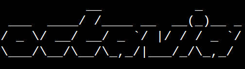

> Advanced wrapper for youtube-dl. Makes downloading and converting videa breeze!


### Features
- **-** Copy and paste youtube links and bulk download.
- **-** Cleans up common junk from video/song titles.

---

### Prerequisities
- Python 2
- youtube-dl


### Installing
- **Linux:**

Install(or upgrade) youtube-dl
```
$ python octavia.py -U
```

Create a symlink to octavia.py. Places the symlink in your ~/bin folder so it's universally accessible(or should be)

```
$ ./setup.py
```

---

## Usage
Access the copy/paste prompt:
```
$ octavia.py
```

For help: 
```
octavia.py -h
```

***EXAMPLES:***
> Extract just the mp3 audio and clean the titles.
```
octavia.py -c
```

> Extract just the videos:
```
$ octavia.py -V
```

> Pass in a text file of URL's
```
$ octavia.py -l listofurls.txt
```

---


## Meta
##### Author: Erik Lunna
##### Email -- eslunna@gmail.com

[]
[WTFPL]: See ``LICENSE`` for full text.
